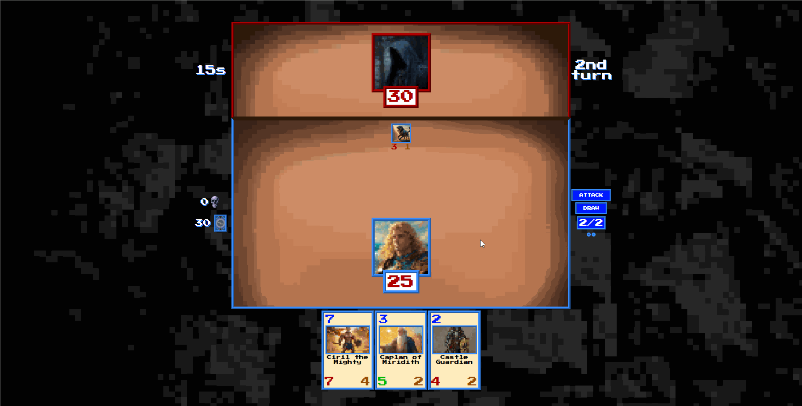

<p align="center">
  
</p>

# Draw or Attack - Javascript project
drawOrAttack is a card game inspired by Hearthstone made by Blizzard. At the start of the game user gets a set of 3 random cards and then the battle begins. The first one that has 0 health loses the game. This is my first custom project and I remember It as a huge milestone in my web-dev journey. The idea behind the project was to learn vanilla JavaScript, design patterns such as MVC and singleton, CSS and HTML.

# [Live DEMO](https://power-space.vercel.app)


<br>
<br>

## Tech stack
The application was developed by using these tools:
- HTML,
- CSS,
- JavaScript
<br>
  
## Getting Started

Follow these steps to install drawOrAttack on your local environment.
<br>
<strong>Clone projects repository</strong>
```
git clone https://github.com/KamilTomczykDev/drawOrAttack.git
```
<strong>Install the packages</strong>
```
npm install
```

<strong>Run the app using terminal</strong>
```
npm start
```
<br>

# Requirements

## General:
- Build a game using vanilla JavaScript.
- Use best practices to provide good performance, scalability and readability of the project.
- Create responsive UI that looks like an oldschool RPG game.

## Start screen:
- Allow user to start the game.
- Create a footer that navigates to authors github and linkedIn profile.

## Game:
### Game logic:
- Draw first cards to the players hand.
- Przycisk "Draw" musi dołożyć jedną kartę do ręki gracza z talii kart.
- Przycisk "Attack" ma zsumowany atak wszystkich kart odjąć od życia przeciwnika
- Jeśli liczba kart w ręce przekroczy swój limit to nowo dobrana karta ląduje od razu na cmentarzu.
- Na początku każdej tury karty, których liczba pozostałych tur wynosi 0 lądują na cmentarzu.
### Enemy:
- Create 3 stages of the enemy that have different healing and attacking attributes and change them throughout the game.
- Allow user to see the enemy description.
- On each turn deal damage to the player and heal enemy's character.

### Player:
- Allow player to play the cards from the hand.
- Allow player to make one of the moves per turn: Draw or Attack.
### Cards:
- Wyświetlanie statystyk kart na stole i w ręce.

